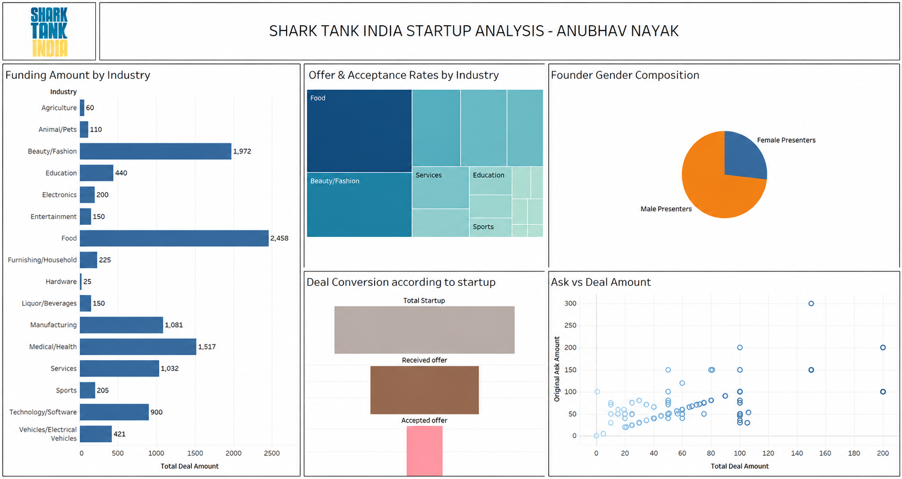

# 🦈 Shark Tank India Startup Analysis 📊

## 📌 Project Overview

This project was completed as part of the **Elevate Labs Data Analyst Internship**.

The objective of this project is to analyze **Shark Tank India** startup investment data using **Tableau**. The interactive dashboard provides insights into funding trends, founder demographics, industry-wise investments, deal conversion rates, and funding patterns through effective data visualization.

---

## 📷 Dashboard Preview

---

## 📁 Files Included

- `shark_tank.csv` – Cleaned dataset containing startup names, industries, funding requests, and investment outcomes.
- `Shark Tank dashboard.twb` – Tableau workbook containing the complete interactive dashboard.
- `Dashboard.png` – Dashboard preview image.
- `README.md` – Project documentation.

---

## 📊 Dashboard Features

### 1️⃣ Funding Amount by Industry
Displays the total investment received across different startup industries.

### 2️⃣ Offer & Acceptance Rates
Visualizes industries based on the number of investment offers received and accepted.

### 3️⃣ Founder Gender Composition
Shows the distribution of male and female startup founders.

### 4️⃣ Deal Conversion Funnel
Represents the startup journey from:
- Total Startups
- Received Offers
- Accepted Offers

### 5️⃣ Ask vs Deal Amount
Compares the original funding requested by startups with the actual deal amount received.

---

## 📈 Key Insights

- Food and Beauty/Fashion startups received the highest investments.
- Male founders represented the majority of startup pitches.
- Not every investment offer resulted in a successful deal.
- Several startups secured investments that differed from their original funding requests.

---

## 🛠️ Tools & Technologies

- Tableau
- Microsoft Excel
- CSV Dataset

---

## 🚀 How to Run the Project

1. Clone or download this repository.
2. Open **Shark Tank dashboard.twb** in Tableau Desktop.
3. Explore the interactive dashboard using filters and visualizations.

---

## 👨‍💻 Internship Information

**Internship:** Elevate Labs – Data Analyst Internship

**Project:** Shark Tank India Startup Analysis

---

## 👤 Author

**Anubhav Nayak**

B.Tech CSE (3rd Year)

Institute of Technical Education and Research (ITER), SOA University

GitHub: https://github.com/anubhavnayakrocky05

---

## 📜 License

This project is created for educational purposes as part of the **Elevate Labs Data Analyst Internship**.
